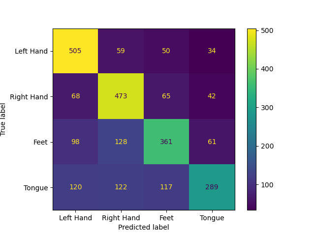

# End-to-End Deep Learning for EEG Motor Imagery Classification

---

This project is an end-to-end pipeline for classifying motor imagery tasks from raw EEG data using the EEGNet architecture. It takes the BCI Competition IV, Dataset 2a, preprocesses the raw signals, trains a deep learning moel, and evaluates its performance.

This repository is designed to be a clean, reproducible, and well-documented demonstration of key skills in BCI development, dfrom signal processing with MNE to model implementation in PyTorch.

## Results

After training on the data for all subject 1-9, the model acheived a final evaluation accuracy of **62.81%** on all the corresponding evaluation sets combined.

The confusion matrix below shows the model's performance on each of the four classes. The diagonal represents the correct predictions, while off-diagonal values indicate where the model made errors.



## Getting Started

Follow these instructions to set up the project and reproduce the results on your local machine.

### Prerequisites

-   Python 3.9+
-   Git
-   Miniconda or Anaconda

### Installation

1. **Clone the project:**
   Since this project is housed under a larger repository, it may be easier to download just the EEG Motor Imagery DL folder as a zip to get a hold of the project, then move onto step 2.

    Otherwise, you can clone the larger repository using script below:

    ```bash
    git clone https://github.com/jaspershen21/Summer-2025-Deep-Learning.git
    cd Summer\ 2025\ Deep\ Learning/EEG\ Motor\ Imagery\ DL/
    ```

2. **Create and activate the Conda environment:**

    ```bash
    conda env create --name eeg-motor-imagery-dl python=3.13
    conda activate eeg-motor-imagery-dl
    ```

3. **Install required packages:**
    ```bash
    conda install numpy matplotlib scikit-learn scipy
    pip install mne tqdm
    ```
    To install PyTorch, please refer to their [installation guide](https://pytorch.org/get-started/locally/) to avoid installing the incorrect version.

## Usage

The entire pipeline is run from the command line using a few simple scripts.

### Step 1: Download the Data

This project uses the **BCI Competition IV, Dataset 2a**.

1. Download the data from the [official website](https://www.bbci.de/competition/iv/).
1. Download the true labels from [here](https://www.bbci.de/competition/iv/)
1. Unzip the files.
1. Place the subject files (e.g., `A01T.gdf`, `A01E.gdf`) into the `data/raw` directory and place the true labels (e.g., `A01T.mat`, `A01E.mat`) into the `data/true labels/` directory.

### Step 2: Preprocess the Data

These scripts filter the raw data using a band-pass filter from 0.5Hz to 40Hz, removes artifacts using ICA, and segments the data into 4-second trials (epochs).

```bash
python scripts/preprocess_training.py
python scripts/preprocess_evaluation.py
```

These will generate `-epo.fif` files for all subjects in your `data/processed/` directory.

### Step 3: Train the Model

This script loads the preprocessed training data, splits it into training and validation sets, and trains EEGNet. The best-performing model based on validation accuracy is saved automatically.

```bash
# Run with default hyperparameters (Batch Size = 32, Epochs = 100, Learning Rate = 0.001, Weight Decay = 0.0, Dropout Rate = 0.5)
python scripts/train.py

# Or specify your own hyperparameters
python scripts/train.py --batch-size 16 --epochs 500 --learning-rate 0.001 --weight-decay 0.0001
```

Alternatively, you can perform 10-fold cross-validation for hyperparameter tuning.

```bash
# Run with default hyperparameters (Batch Size = 32, Epochs = 100, Learning Rate = 0.001, Weight Decay = 0.0, Dropout Rate = 0.5)
python scripts/hyperparameter_tuning.py

# Or specify your own hyperparameters
python scripts/hyperparameter_tuning.py --batch-size 16 --epochs 500 --learning-rate 0.001 --weight-decay 0.0001
```

The best model will be saved to `models/best_model.pth` if not specified.

### Step 4: Evaluate the Final Model

This script loads the best saved model (`best_model.pth`) and evaluates it against the held-out evaluation set, printing the final accuracy and generating the confusion matrix plot.

```bash
python scripts/evaluate_model.py
```

## Methodology

### Data Preprocessing

The raw `.gdf` files are processed using the MNE-Python library. The key steps are:

-   **Filtering:** A 0.5 Hz - 40 Hz band-pass filter is applied to remove slow drifts and high-frequency noise, with a 50 Hz notch filter which was applied during data collection.
-   **Artifact Removal:** Independent Component Analysis (ICA) is used to identify and remove components related to eye-blink artifacts.
-   **Epoching:** The cleaned data is segmented into 4-second trials corresponding to the four motor imagery tasks (left hand, right hand, feet, tongue).

### Model Architecture

This project implements **EEGNet**, a compact and efficient convolutional neural network designed specifically for EEG-based brain-computer interfaces. It uses depthwise and separable convolutions to capture temporal and spatial features from EEG signals effectively. See the original paper [here](https://arxiv.org/pdf/1611.08024)
